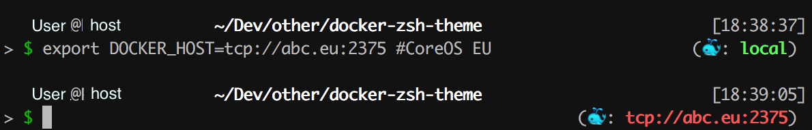

# Docker Theme 

This theme is pretty much based on the 'bureau' theme. It has been extended by a `DOCKER_HOST` live view,
so that in every terminal session you see imitiatelly which docker host is configured and where the local 
docker commands are forwarded to. 
If the `DOCKER_HOST` variable is not set in the terminal sesion, it's showing a green `local` text what can b
interpreted as a personal local test environment. If a remote host is defined it will show the address in `red`.

## Installation
Copy the `docker.zsh-theme` file into your local `oh-my-zsh/themes` folder. Usually its located in your home directory `~/.oh-my-zsh/`.
Adjust your `.zshrc` file to use the docker enabled theme.

## License

[MIT](https://github.com/fdaciuk/licenses/blob/master/MIT-LICENSE.md) &copy; David Dornseifer 

